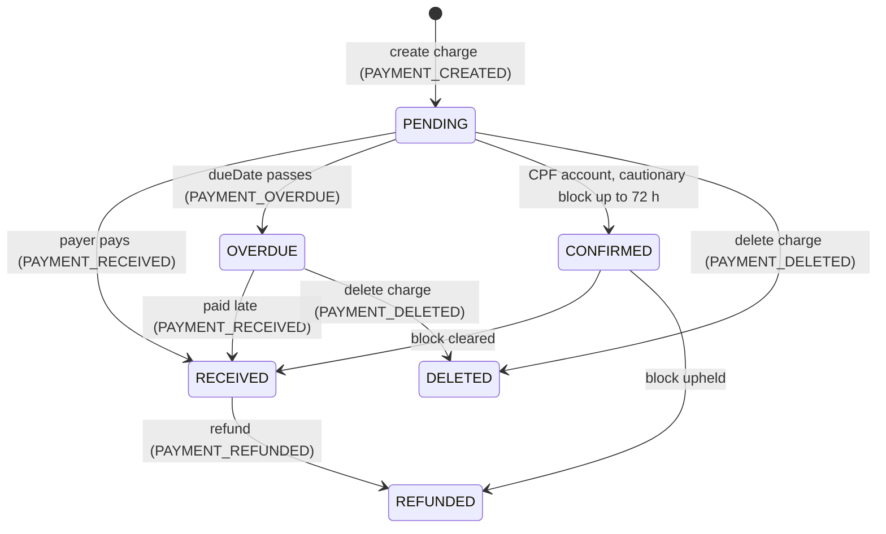
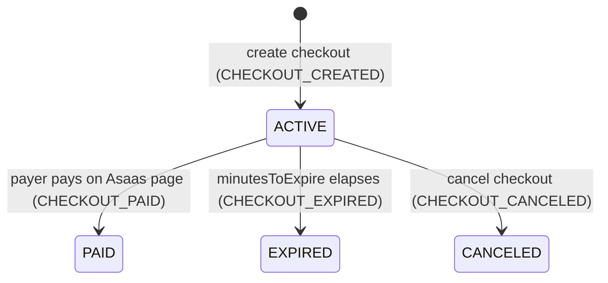
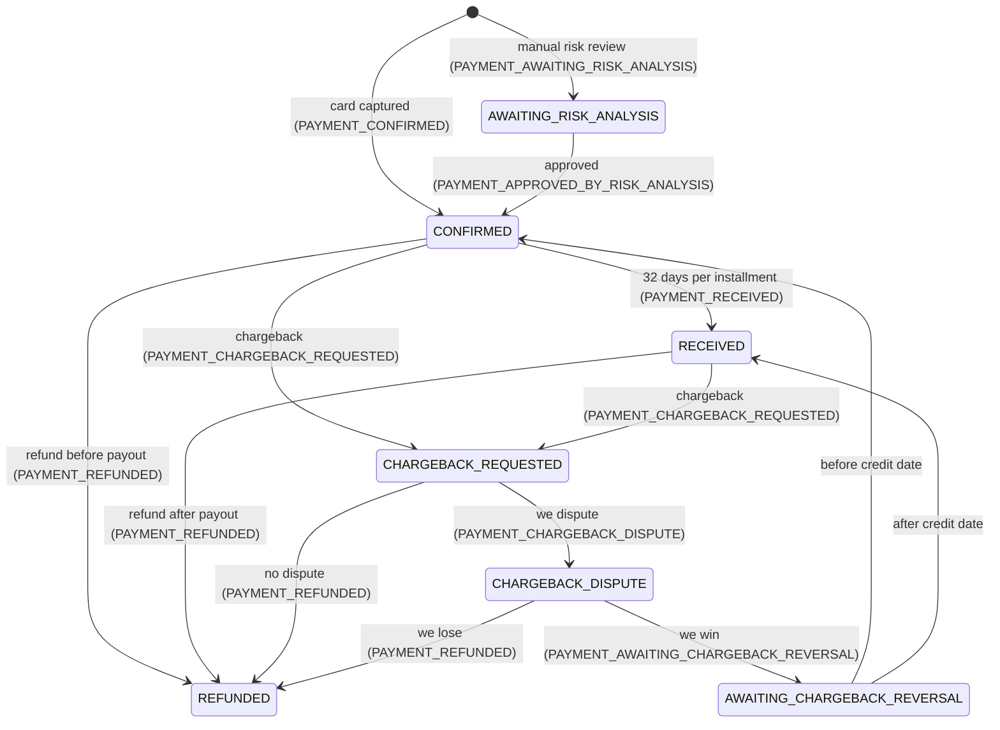

# Asaas for Pix and interest-free card installments

- **Ticket**: [#2](https://github.com/dev-labs-ai/aulaflix-api/issues/2), "How Asaas covers Pix and interest-free card installments"
- **Researched**: 2026-10-03. Every fee, limit and behaviour below was read on that date from Asaas's own pages: the pricing page, the API docs at `docs.asaas.com` and the help centre at `central.ajuda.asaas.com`. Where a docs page shows an `updatedAt` date, the citation includes it.
- **Scope**: the owner already chose Asaas. This note checks each requirement against Asaas and gives the order-lifecycle decision the facts it needs. Other gateways get only a [short appendix](#appendix-other-gateways-short).
- **Marking**: a claim marked **unverified** could not be confirmed from a first-party page. Each one comes with the check that would settle it, usually a sandbox run.

## Answer

Asaas meets every hard requirement, with three caveats that shape the design.

1. **Card data stays off our servers only on Asaas-hosted pages.** These are the Asaas Checkout, the charge's Fatura (`invoiceUrl`) and a Payment Link. Asaas documents no client-side tokenization and no hosted fields. Sending card data through its API puts our backend in PCI scope. So the card flow is a redirect to the **Asaas Checkout**. It is the only hosted flow documented to let the payer choose the number of installments (`maxInstallmentCount`, 1–21).
2. **Installment money arrives monthly.** Each installment is released every 32 calendar days. A 10x sale is fully paid out only after about 10 months, unless we pay to anticipate it. The seller absorbs the fee: R$ 0.49 + 3.99% on the total for 7–12 installments at the standard rate. Asaas adds no interest for the buyer.
3. **Webhook authentication is a static shared token** sent in the `asaas-access-token` header. Asaas also publishes a list of production source IPs. It does not sign webhooks with an HMAC. Treat a webhook as a trigger and re-read the charge through the API before granting an Enrollment.

The recommended integration shape has two parts. **Pix** is a direct charge (`POST /v3/payments`, `billingType=PIX`) whose QR code the web renders on our own page. **Card** goes through an Asaas Checkout with `chargeTypes=[DETACHED, INSTALLMENT]` and `maxInstallmentCount=10`. Refunds use `POST /v3/payments/{id}/refund` for Pix and `POST /v3/installments/{id}/refund` for card installments. Fiscal invoices (NFS-e) can be issued through the same API for R$ 0.49 each, but **only from a CNPJ (company) account**.

## Requirement checklist

| Requirement | Verdict | Evidence |
|---|---|---|
| Pix, with a price discount for Pix | **Met.** We set the price per payment method ourselves. | A Pix charge is created with whatever `value` we send ([Criar nova cobrança][ref-create-payment]). Asaas's own `discount` field is an early-payment discount ("dias antes do vencimento"), not a per-method price ([same schema][ref-create-payment]). Applying discounts to Pix is also listed as unavailable in the sandbox ([help: sandbox coverage][help-sandbox-coverage]). A single Checkout cannot price Pix and card differently: `items[].value` is shared by every `billingTypes` entry ([Criar novo checkout][ref-create-checkout]). |
| Card in up to 10 interest-free installments, seller absorbs the cost | **Met.** | The Checkout accepts `installment.maxInstallmentCount` from 1 to 21 ([Checkout para cartão][doc-checkout-card]). Visa and Mastercard allow up to 21 installments and other brands up to 12, so 10 works for every brand ([Cobranças via cartão][doc-card]). Asaas cannot add interest from a given number of installments; interest applies only to late payment ([help: juros por parcela][help-no-installment-interest]). The card fee is charged to the seller "sobre o valor total da venda para parcelamentos" ([pricing][pricing]). Passing the card fee on to the buyer is an opt-in checkbox ("Repassar taxas do cartão") when creating a charge in the web UI; we leave it off ([help: repassar taxas][help-fee-passthrough]). |
| Refunds through the API, within the 7-day window | **Met, with operational caveats.** | `POST /v3/payments/{id}/refund` does full, partial or multiple partial refunds of card or Pix charges. A card charge can be refunded while `CONFIRMED` or `RECEIVED`. Fees are **not** returned, and a Pix refund fails with `400` if the available balance is short ([Estornar cobrança][ref-refund]). `POST /v3/installments/{id}/refund` refunds a whole card installment plan, fully or partly ([Estornar parcelamento][ref-refund-installment]). A Pix refund is possible up to 90 days after receipt and costs nothing ([help: regras do estorno Pix][help-pix-refund-rules]). |
| Webhooks for asynchronous confirmation | **Met, with weaker authentication** (see [Webhooks](#webhooks)). | Payment and Checkout events, at-least-once delivery, retries, ordered delivery available ([Introdução - Webhooks][doc-webhooks-intro], [FAQ de Webhooks][doc-webhooks-faq]). |
| Sandbox | **Met.** | A separate account at `https://api-sandbox.asaas.com/v3`. Payments are confirmed manually, card outcomes are simulated with test cards, and the token `000000` stands in for critical-action codes ([Sandbox][doc-sandbox], [cartão no sandbox][doc-sandbox-card], [ações críticas][doc-critical-actions]). |
| Card data never touches our servers | **Met only through Asaas-hosted pages.** | The PCI page names three flows where the payer types card data on an Asaas-controlled page: Checkout, Fatura and Payment Link. It says direct API use and server-side tokenization keep our infrastructure in scope ([PCI-DSS][doc-pci]). The docs index lists no client-side or JavaScript tokenization ([docs index][docs-index]). |
| NFS-e | **Available, CNPJ only.** | NFS-e can be issued through the API and linked to a charge or an installment plan ([Notas fiscais][doc-nfse-intro]). It costs R$ 0.49 per note ([pricing][pricing]). "O Asaas não emite NFS-e para Pessoa Física" ([help: requisitos NFS-e][help-nfse-reqs]). |
| Java backend | **Met. Plain REST is advised over the SDK.** | A REST API with JSON and an API-key header ([Autenticação][doc-auth]). The official Java SDK `com.asaas:api-sdk` 1.0.3 was last released on 2025-07-04 ([Maven Central metadata][maven-asaas], [GitHub releases][gh-asaas-sdk]). |

## Fees and payout timing

All figures are Asaas's **standard** list prices as of 2026-10-03 ([pricing page][pricing]). New accounts get promotional rates for 3 months from sign-up; the page's own example says an account created today keeps them until 03/01/2027 ([pricing FAQ][pricing]). The page says contracted rates can differ. `GET /v3/myAccount/fees/` returns the fees that actually apply to an account, including the card tiers and `daysToReceive` ([Recuperar taxas da conta][ref-fees]).

| Item | Standard | Promo (first 3 months) | Payout |
|---|---|---|---|
| Pix received | R$ 1.99 per transaction | R$ 0.99 | Available "em alguns instantes" after payment ([help: Pix][help-pix-payout]) |
| Card, single payment | R$ 0.49 + 2.99% | R$ 0.49 + 1.99% | Up to 32 calendar days ([help: cartão][help-card-payout]) |
| Card, 2–6 installments | R$ 0.49 + 3.49% | R$ 0.49 + 2.49% | **Each installment released every 32 calendar days** ([help: cartão][help-card-payout]) |
| Card, 7–12 installments (our 10x) | R$ 0.49 + 3.99% | R$ 0.49 + 2.99% | Same |
| Card, 13–21 installments | R$ 0.49 + 4.29% | R$ 0.49 + 3.29% | Same |
| Card anticipation (paid early payout) | 1.25% a month in the price table. The page's FAQ says 1.25% a month for single payments and **1.70%** a month for installments. The page contradicts itself. | n/a | "Recebimento em até 2 dias úteis. Sujeito a análise de crédito" |
| NFS-e issued | R$ 0.49 per note | n/a | n/a |
| Email and SMS notifications to the payer | R$ 0.99 per notification bundle, charged when the payer pays | n/a | n/a |
| WhatsApp notification | R$ 0.55 per message | n/a | n/a |
| Pix transfers out (withdrawals) | Free for individual (CPF) accounts. CNPJ accounts get 30 free per month, then R$ 2.00 each. | n/a | n/a |
| TED transfer out | R$ 5.00 | n/a | n/a |
| Monthly fee, sign-up fee, issuing or cancelling charges | Free | n/a | n/a |

Notes:

- **How the card fee is applied.** The percentage is charged on the **total** of an installment sale, plus R$ 0.49 once per charge. The net amount is split across the installments. The page's FAQ example uses the promo rate: R$ 200 in 5x nets R$ 195.53, which is R$ 39.11 per installment. The example's line "R$ 0,60" is a typo, since 1.99% of 200 is R$ 3.98, and R$ 0.49 + R$ 3.98 is what yields R$ 195.53 ([pricing FAQ][pricing]).
- **Worked example (my arithmetic from the standard rates).** A R$ 500.00 course sold in 10x pays R$ 0.49 + 3.99% × 500, which is **R$ 20.44** (about 4.1%). That nets R$ 479.56, released in 10 parts at 32-day intervals. The same course paid by Pix at, say, R$ 450.00 costs a flat **R$ 1.99** and is available immediately.
- **Turn payer notifications off.** Asaas's own email and SMS reminders cost R$ 0.99 on every paid charge ([pricing][pricing]). They would also duplicate our transactional email. Create customers with `notificationDisabled: true` ([Criar novo cliente][ref-create-customer]). Whether customers created inside a Checkout inherit notifications is **unverified**; check the account's notification defaults in the sandbox.
- **Fees are not returned on refund** ([Estornar cobrança][ref-refund]).
- **The anticipation rate is ambiguous on the pricing page** (1.25% or 1.70% a month for installment sales). The exact cost comes from `POST /v3/anticipations/simulate` ([Antecipação][doc-anticipation]). That endpoint is listed as unavailable in the sandbox ([help: sandbox coverage][help-sandbox-coverage]), so only a production account settles it.

## Account requirements: CPF or CNPJ

Both are accepted, but the account type changes several things:

| Topic | CPF (individual) account | CNPJ (company) account | Source |
|---|---|---|---|
| Opening | Allowed | Allowed | [pricing][pricing], [help: análise cadastral][help-account-review] |
| Account review time | 2–7 business days | Up to 2 business days. Charges can be issued and received while the review runs, but the balance cannot be moved until approval. | [help: análise cadastral][help-account-review] |
| **NFS-e issuing** | **Not available** | Available. Also needs a municipal registration, access to the city's or the National Portal, and the city's authentication method. | [help: requisitos NFS-e][help-nfse-reqs] |
| Pix charges | A **cautionary block** can hold a received Pix in `CONFIRMED` for up to 72 h; it then moves to `RECEIVED` or `REFUNDED`. | No such note | [Criar nova cobrança][ref-create-payment], [help: bloqueio cautelar][help-pix-block] |
| Pix keys (recommended for Pix charges; without one, QR codes fall back to a slower, transitional same-day mode) | Up to 5 | Up to 20 | [Introdução - Pix][doc-pix], [Obter QR Code][ref-pix-qr] |
| Pix transfers out | Free | 30 free per month, then R$ 2.00 | [pricing][pricing] |
| Switching later | A CPF account can move to a CNPJ account if the CNPJ is active and the account holder is its managing partner. The reverse move and CNPJ-to-CNPJ moves are not allowed. | n/a | [help: PF para PJ][help-pf-to-pj] |

Selling courses is not on Asaas's list of restricted business activities as of 2026-10-03 ([help: atividades restritas][help-restricted]).

**Payer identity.** `POST /v3/customers` requires `name` and `cpfCnpj` ([Criar novo cliente][ref-create-customer]). A direct Pix charge needs a customer, so **we must collect the Student's CPF** before creating it. The Checkout can instead let the payer fill in their own data on the Asaas page ([Checkout introduction][doc-checkout-intro]).

## Fiscal invoices (NFS-e)

- **What Asaas does.** It sends the NFS-e to the city hall or the National Portal on the company's behalf. The flow is: read the city's requirements (`GET /v3/fiscalInfo/municipalOptions`), save the account's fiscal data (`POST /v3/fiscalInfo`), then schedule a note with `POST /v3/invoices`, linked to a `payment`, an `installment` or a bare `customer`. Issuing is asynchronous: `SCHEDULED` → `SYNCHRONIZED` → `AUTHORIZED`, or `ERROR`. Cancelling is possible only where the city allows it. Webhooks report `INVOICE_AUTHORIZED` and `INVOICE_ERROR` ([Introdução - Notas Fiscais][doc-nfse-intro], [Emitindo NFS-e][doc-nfse-issue], [FAQ NFS-e][doc-nfse-faq]).
- **Prerequisites.** A CNPJ account, a regular municipal registration, city approval for web-service issuing (MEI and National Portal issuers are exempt), and the city's authentication method: username and password, a certificate or a token ([help: requisitos NFS-e][help-nfse-reqs], [Configurar informações fiscais][doc-fiscal-info]).
- **Lock-in.** Once a company issues through Asaas, it must not issue NFS-e from any other system, because Asaas controls the RPS and note numbering ([help: requisitos NFS-e][help-nfse-reqs]).
- **Cost.** R$ 0.49 per note ([pricing][pricing]). Configuration and issuing work in the sandbox, subject to each city's integration ([Introdução - Notas Fiscais][doc-nfse-intro]).
- **Not answered here.** Whether AulaFlix is legally required to issue NFS-e for course sales is a tax question for the owner's accountant. Asaas covers the *how*, but only from a CNPJ.

## Keeping card data off our servers

| Flow | Where the card is typed | Payer chooses installments? | PCI impact (per Asaas) |
|---|---|---|---|
| **Asaas Checkout** (`POST /v3/checkouts`) | Asaas-hosted page | **Yes**, up to `maxInstallmentCount` (1–21) ([Checkout para cartão][doc-checkout-card]) | "Pode reduzir o escopo" ([PCI-DSS][doc-pci]) |
| Fatura (`invoiceUrl` of a charge created without card data) | Asaas-hosted page | **Unverified.** The installment count is set when the charge is created (`installmentCount`) ([Criar uma cobrança parcelada][doc-installments]); docs don't say if the Fatura lets the payer change it. Settle it in the sandbox. | "Pode reduzir o escopo" |
| Payment Link (`POST /v3/paymentLinks`) | Asaas-hosted page | Not evaluated | "Pode reduzir o escopo" |
| Direct API (`creditCard` + `creditCardHolderInfo` on `POST /v3/payments`) | **Our page and backend** | We decide | "Sua infraestrutura permanece no escopo" |
| Server-side tokenization (`POST /v3/creditCard/tokenizeCreditCard`) | **Our backend** | n/a | Stays in scope. Production use also needs Asaas to enable it ([Tokenização][ref-tokenize]). |

**Conclusion: the card flow is a redirect to the Asaas Checkout.** Consequences:

- The payer leaves our site for the card step. `callback.successUrl`, `cancelUrl` and `expiredUrl` bring them back. These redirects are **not** proof of payment; only the webhook confirms it ([Checkout introduction][doc-checkout-intro]).
- A Checkout lives 10 to 1440 minutes (`minutesToExpire`) and can be cancelled with `POST /v3/checkouts/{id}/cancel` ([FAQ do Checkout][doc-checkout-faq]).
- **Use the `link` the API returns; don't build the URL.** The guide shows `https://asaas.com/checkoutSession/show?id=…` ([Link do checkout][doc-checkout-link]). Since 2026-09-28 Asaas is gradually changing its public URL formats, Checkout included, and says to use returned URLs exactly as given ([changelog: URLs públicas][changelog-urls]).
- **Unverified: `items[].imageBase64` may be mandatory.** The OpenAPI schema marks it required ([Criar novo checkout][ref-create-checkout]). The errors guide lists only `name`, `quantity` and `value` as required ([Erros comuns do Checkout][doc-checkout-errors]). Settle it with one sandbox call.

## Recommended integration shape

- **Pix (stays on our page).**
  1. Create or reuse the Asaas customer with `cpfCnpj` and `notificationDisabled: true`.
  2. Create the charge: `POST /v3/payments` with `billingType: PIX`, `value` set to the Pix price, `dueDate` set to today and `externalReference` set to our order id.
  3. Fetch the QR code with `GET /v3/payments/{id}/pixQrCode`. It returns `encodedImage` (base64 PNG), `payload` (the copy-and-paste code) and `expirationDate`.
  4. The BFF renders them on our page ([Cobranças via Pix][doc-pix-charge], [Obter QR Code][ref-pix-qr]).
- **Card (redirect).** Create a Checkout with `billingTypes: [CREDIT_CARD]`, `chargeTypes: [DETACHED, INSTALLMENT]`, `installment.maxInstallmentCount: 10`, the card price in `items`, `externalReference` set to our order id and the three callback URLs. Redirect the browser to the returned `link` ([Checkout para cartão][doc-checkout-card]).
- **Alternative for Pix.** A Pix-only Checkout (`billingTypes: [PIX]`, priced at the Pix amount) gives one integration model and Asaas-managed expiry, at the cost of a redirect ([Checkout para Pix][doc-checkout-pix]).
- **Confirmation.** Webhook, then re-read the charge with `GET /v3/payments/{id}`, then create the Enrollment (see [Webhooks](#webhooks)).

## End-to-end states

Payment `status` values defined by the API: `PENDING`, `RECEIVED`, `CONFIRMED`, `OVERDUE`, `REFUNDED`, `RECEIVED_IN_CASH`, `REFUND_REQUESTED`, `REFUND_IN_PROGRESS`, `CHARGEBACK_REQUESTED`, `CHARGEBACK_DISPUTE`, `AWAITING_CHARGEBACK_REVERSAL`, `DUNNING_REQUESTED`, `DUNNING_RECEIVED`, `AWAITING_RISK_ANALYSIS`. Each entry in a charge's `refunds[]` has its own `status`: `PENDING`, `AWAITING_CRITICAL_ACTION_AUTHORIZATION`, `AWAITING_CUSTOMER_EXTERNAL_AUTHORIZATION`, `CANCELLED`, `DONE` ([Recuperar uma única cobrança][ref-get-payment]). A refund counts as done only at `DONE` ([Estornos][doc-refunds]).

### Pix charge

`DELETED` is not an API status. A deleted charge comes back with `deleted: true` ([Recuperar uma única cobrança][ref-get-payment]). A partial refund emits `PAYMENT_PARTIALLY_REFUNDED`. `PAYMENT_REFUND_IN_PROGRESS` means a refund is scheduled and will run when settlement happens ([Eventos para cobranças][doc-payment-events]).

| Step | Call / event | Facts |
|---|---|---|
| Create | `POST /v3/payments` → `PENDING`, `PAYMENT_CREATED` | Creating a charge does not confirm payment ([Criar nova cobrança][ref-create-payment]) |
| Show QR | `GET /v3/payments/{id}/pixQrCode` | Dynamic and single-use. With a Pix key registered, it expires **12 months after `dueDate`**. Without a key, a transitional mode creates a QR at a partner institution, payable until 23:59 the same day; Asaas says this mode will be discontinued ([Obter QR Code][ref-pix-qr]). Pix keys can be created only after the account is fully approved and the liveness check is done ([Introdução - Pix][doc-pix]). |
| Paid | `PAYMENT_RECEIVED` | The Pix flow is CREATED → RECEIVED, or CREATED → OVERDUE → RECEIVED if paid after `dueDate` ([Eventos para cobranças][doc-payment-events]). The money is available within moments ([help: Pix][help-pix-payout]). |
| CPF account caveat | `CONFIRMED` (temporary) | A cautionary block of up to 72 h, then `RECEIVED` or `REFUNDED` ([Criar nova cobrança][ref-create-payment], [help: bloqueio cautelar][help-pix-block]) |
| Abandoned order | `DELETE /v3/payments/{id}` → `PAYMENT_DELETED` | **Lifecycle impact:** an unpaid Pix charge stays payable after `dueDate` (`OVERDUE` → `RECEIVED`), and its QR lives up to 12 months. Our order expiry must therefore delete the charge, or accept a late payment. Deleting is not a refund ([Excluir cobrança][ref-delete-payment]). |
| Refund | `POST /v3/payments/{id}/refund` (with no `value` it refunds in full) | Full or several partial refunds, up to the total. Fees are not returned. A **`400`** comes back if the available balance cannot cover the refund ([Estornar cobrança][ref-refund]). Possible up to **90 days** after receipt, free of charge ([help: regras do estorno Pix][help-pix-refund-rules]). Event sequence: RECEIVED → `PAYMENT_REFUNDED` ([Eventos para cobranças][doc-payment-events]). If the optional withdrawal-validation webhook is enabled for Pix refunds, our endpoint must approve each one (`type: PIX_REFUND`) ([Validação de saque][doc-withdrawal-validation]). |

### Card charge (through the Checkout, 1–10 installments)

Checkout states (the hosted page):

Payment states, once for each installment charge the Checkout creates:

| Step | Call / event | Facts |
|---|---|---|
| Create checkout | `POST /v3/checkouts` → `{id, link, status: ACTIVE}`, `CHECKOUT_CREATED` | Checkout states are `ACTIVE`, `PAID`, `CANCELED` and `EXPIRED` ([FAQ do Checkout][doc-checkout-faq], [Criar novo checkout][ref-create-checkout]) |
| Payer pays | `CHECKOUT_PAID`, plus payment events for the charge(s) created | Charges carry a `checkoutSession` field holding the Checkout id ([Recuperar uma única cobrança][ref-get-payment]). The Checkout webhook payload, as documented, holds the checkout object but **no payment id** ([Eventos para Checkout][doc-checkout-events]). We correlate through `payment.checkoutSession`. **Unverified:** whether that field is present in webhook payloads, and whether the Checkout's `externalReference` is copied onto the charge. Settle both in the sandbox. |
| Installment structure | One `installment` id plus N charges | Every installment is its own charge with its own `id`, `status` and `installmentNumber`. List them with `GET /v3/installments/{id}/payments` ([Criar uma cobrança parcelada][doc-installments]). **Unverified:** whether `PAYMENT_CONFIRMED` fires once per installment charge. Expect N events and key processing on the `installment` id. |
| Risk review | `PAYMENT_AWAITING_RISK_ANALYSIS` → `APPROVED_BY_RISK_ANALYSIS` / `REPROVED_BY_RISK_ANALYSIS` | Manual risk analysis on card payments ([Eventos para cobranças][doc-payment-events]) |
| Confirmed | `PAYMENT_CONFIRMED` (status `CONFIRMED`) | The card has been captured. If the buyer later fails to pay their card bill, our payout is unaffected; only a chargeback changes it ([help: inadimplência no cartão][help-card-confirmed]). **This is the point to grant the Enrollment.** |
| Received | `PAYMENT_RECEIVED` | 32 days after confirmation for a single payment. For an installment sale, **each installment every 32 days** ([Eventos para cobranças][doc-payment-events], [help: cartão][help-card-payout]). |
| Refund | Installment sale: `POST /v3/installments/{id}/refund`. Single payment: `POST /v3/payments/{id}/refund`. | Allowed while `CONFIRMED` or `RECEIVED`. Sequence: CREATED → CONFIRMED → `PAYMENT_REFUNDED`. A refund inside our 7-day window always lands in `CONFIRMED`, because payout is at D+32 ([Estornar parcelamento][ref-refund-installment], [Eventos para cobranças][doc-payment-events]). The time until the buyer sees it is quoted two ways: "até 10 dias úteis" in the API reference ([Estornar cobrança][ref-refund]), and "até 5 dias úteis ou na próxima fatura" in the help centre ([help: prazo estorno cartão][help-card-refund-time]). |
| Not paid | `CHECKOUT_EXPIRED` / `CHECKOUT_CANCELED` | Create a new Checkout if the buyer comes back ([Checkout para Pix][doc-checkout-pix]) |
| Chargeback | `PAYMENT_CHARGEBACK_REQUESTED` → `PAYMENT_CHARGEBACK_DISPUTE` → `PAYMENT_AWAITING_CHARGEBACK_REVERSAL` → `CONFIRMED`/`RECEIVED` if we win, or `PAYMENT_REFUNDED` if we lose or don't dispute | `chargeback.status` is one of `REQUESTED`, `IN_DISPUTE`, `DISPUTE_LOST`, `REVERSED`, `DONE` ([Eventos para cobranças][doc-payment-events], [Chargeback][doc-chargeback]). Enrollment policy on a chargeback is an open lifecycle decision. |

**Unverified: whether refunds can stall.** The refund status enum includes `AWAITING_CRITICAL_ACTION_AUTHORIZATION` and `AWAITING_CUSTOMER_EXTERNAL_AUTHORIZATION` ([Recuperar uma única cobrança][ref-get-payment]). The docs do not say when an API refund enters them. Asaas uses "ações críticas" with SMS or app tokens for outgoing money ([ações críticas][doc-critical-actions]). An Admin-triggered refund may therefore sit waiting for someone to approve it in the Asaas UI. Run a Pix refund in the sandbox and on the production account before go-live. Keep the Enrollment open until the refund reaches `DONE`, or end it at request time; that is a lifecycle decision.

## Webhooks

| Topic | Fact | Source |
|---|---|---|
| Authentication | An optional `authToken` (32–255 characters, no spaces, not an API key) is sent on every delivery in the `asaas-access-token` header. Its value is shown only once, when the webhook is created. **There is no HMAC signature, Bearer or Basic authentication.** | [Criar webhook pela API][doc-webhook-create], [FAQ de Webhooks][doc-webhooks-faq] |
| Source IPs (production) | 52.67.12.206, 18.230.8.159, 54.94.136.112, 54.94.183.101. The sandbox may use others. | [IPs oficiais][doc-webhook-ips] |
| Success | **Only HTTP 200** counts; any other 2xx is a failure. Asaas waits up to 10 s. It does not follow 3xx redirects. | [FAQ de Webhooks][doc-webhooks-faq] |
| Retries | Progressive retries. After **15 consecutive failures** the queue pauses. Pending events are kept **14 days**, then deleted for good. | [Introdução - Webhooks][doc-webhooks-intro] |
| Delivery semantics | At-least-once. The event `id` stays the same on redelivery, so use it for idempotency. `sendType: SEQUENTIALLY` keeps order; `NON_SEQUENTIALLY` does not. | [FAQ de Webhooks][doc-webhooks-faq], [Tipos de envio][doc-send-types] |
| Limits | Up to 10 webhooks per account. Sandbox and production are configured separately. | [Criar webhook pela API][doc-webhook-create] |
| Forward compatibility | New fields can appear in payloads at any time. A parser that fails on unknown fields will stall the queue. | [Eventos para cobranças][doc-payment-events] |

**Gap and mitigation.** A static token gives no payload integrity and no replay protection. To mitigate:

1. Compare `asaas-access-token` in constant time.
2. Allow only the production IPs at the reverse proxy.
3. Persist the event by `id` and return 200 at once.
4. Before creating an Enrollment, re-read the charge with `GET /v3/payments/{id}` using our API key, and act on that response rather than on the webhook body.

## REST API and Java

- **Base URLs.** Production is `https://api.asaas.com/v3` and the sandbox is `https://api-sandbox.asaas.com/v3`. Each environment has its own account and keys. Production keys start with `$aact_prod_` and sandbox keys with `$aact_hmlg_` ([Autenticação][doc-auth], [Sandbox][doc-sandbox]).
- **Request headers.** The key goes in `access_token`. `User-Agent` is mandatory for root accounts created from 2024-06-13 on. TLS 1.2 or 1.3 ([Autenticação][doc-auth]).
- **Key lifecycle.** A key can be created only in the web UI and is shown once. An account can hold up to 10 keys, and each can carry its own expiry date. **A key unused for 3 months is disabled, and after 6 months it expires for good.** The `ACCESS_TOKEN_*` webhook events warn before that happens ([Chaves de API][doc-api-keys]). An IP allowlist for API calls is available ([Mecanismos de segurança][doc-security]).
- **Rate limits.** `429` comes back when a per-endpoint limit is hit, past **25,000 requests per 12 hours**, or past **50 concurrent GETs**. `RateLimit-*` headers tell you when to retry ([Limites][doc-rate-limits]).
- **Idempotency.** Asaas documents no idempotency-key header. Its guidance is to keep an internal identifier, set `externalReference`, and look the resource up before retrying after a timeout. Otherwise you risk duplicate customers or charges ([Cobrança duplicada após retry][doc-duplicate-retry], [Cobranças via cartão][doc-card], [Cadastro de clientes][doc-customers]).
- **Official Java SDK.** `com.asaas:api-sdk`; the docs name 1.0.3 as current ([SDK Java][doc-java-sdk]), and Maven Central confirms 1.0.3 is the latest, with `lastUpdated` 2025-07-04 ([Maven Central metadata][maven-asaas]). GitHub shows releases v1.0.0 to v1.0.3 between 2025-06-13 and 2025-07-04, generated with liblab, and the last commit on 2025-07-22 ([GitHub][gh-asaas-sdk]). The SDK targets Java 8 and pulls in `jackson-databind` 2.15.0 and `okhttp` 4.12.0 ([SDK pom.xml][gh-asaas-sdk-pom]). It does include a `CheckoutService` ([SDK services][gh-asaas-sdk-services]).
- **Advice (judgment, not a source fact).** We need about six endpoints: customers, payments, the Pix QR code, checkouts, refunds and webhooks admin. A thin Spring `RestClient` adapter with our own record DTOs fits this repo's standards (explicit mapping, no Lombok in our code). It also avoids a stale generated client and a second HTTP and JSON stack. Asaas also publishes an OpenAPI document ([Insomnia guide][doc-insomnia]). Run `./mvnw dependency:tree` before adopting the SDK if you want to see how its Jackson 2 dependency sits next to Boot's managed Jackson.

## Sandbox

- Payment confirmation: `POST /v3/sandbox/payment/{id}/confirm` ([Confirmar pagamento][ref-sandbox-confirm]).
- Card outcomes: any valid-format test number approves; Mastercard `5184019740373151` and Visa `4916561358240741` are declined ([Testando cartão][doc-sandbox-card]).
- Paying a Pix QR code needs a second sandbox account with balance, calling `POST /v3/pix/qrCodes/pay` ([Testar QR Codes Pix][doc-sandbox-pix]).
- Critical actions accept the token `000000` ([ações críticas][doc-critical-actions]).
- Charges, installments, refunds, NFS-e and webhooks are all available. Discounts on Pix and anticipation simulation are not ([help: sandbox coverage][help-sandbox-coverage]).

## Gaps and risks to carry into the spec

1. **The card step is a redirect** to an Asaas-hosted page. Asaas offers no embeddable or hosted-fields card form ([PCI-DSS][doc-pci]).
2. **Installment cash flow.** A 10x sale pays out in 10 parts, one every 32 days. Anticipation costs 1.25–1.70% a month and is subject to credit analysis ([pricing][pricing], [help: cartão][help-card-payout]).
3. **No signed webhooks.** Mitigate as described in [Webhooks](#webhooks).
4. **NFS-e needs a CNPJ account** ([help: requisitos NFS-e][help-nfse-reqs]). A CPF account also brings 72 h Pix cautionary blocks and a longer review ([Criar nova cobrança][ref-create-payment], [help: análise cadastral][help-account-review]).
5. **Pix refunds need available balance**, and fees are not returned ([Estornar cobrança][ref-refund]). Withdrawals should leave a buffer that covers 7 days of possible Pix refunds.
6. **An idle API key is disabled after 3 months** ([Chaves de API][doc-api-keys]). Monitor the `ACCESS_TOKEN_*` events.
7. **One Checkout cannot price Pix and card differently.** Pick the method on our page first ([Criar novo checkout][ref-create-checkout]).
8. **A stale Pix charge stays payable** after `dueDate`. Delete it when the order expires ([Eventos para cobranças][doc-payment-events], [Excluir cobrança][ref-delete-payment]).
9. **The Fatura and Payment Link return URL must be on the domain** registered in the account's business data ([Redirecionamento][doc-redirect]). Whether this also applies to Checkout callbacks is **unverified**. It matters for local and staging environments.

## To verify in the sandbox before the spec freezes

- Is `items[].imageBase64` mandatory on `POST /v3/checkouts`?
- Do payment webhooks carry `checkoutSession`, and is the Checkout's `externalReference` copied onto the charge(s)?
- How many `PAYMENT_CONFIRMED` events does a 10x Checkout sale produce?
- Can an API-triggered refund enter `AWAITING_CRITICAL_ACTION_AUTHORIZATION`, and under which account settings?
- Does a Fatura (`invoiceUrl`) let the payer choose the installment count?
- Do customers created by a Checkout inherit paid email and SMS notifications?
- What do `GET /v3/myAccount/fees/` and the production anticipation simulation return for the real account?

## Appendix: other gateways (short)

Gathered on 2026-10-03, before the owner chose Asaas. These are list prices from each gateway's own page, not checked in depth.

| Gateway | Pix | Card | Interest-free installments | Account | Source |
|---|---|---|---|---|---|
| Mercado Pago | 0.99% online | 4.99% paid now, 3.99% paid at 30 days. The page lists 14-day payout as both 4.99% and 4.49%. | The seller pays an extra fee per installment count, for example **12.41% for 10x**, but gets the full amount on the chosen payout date | not checked | [MP blog, 2026-06-25][mp-blog] |
| Pagar.me | 0.99% | 4.19% single payment, next-day payout. Installment rates not published. | not published | CNPJ or MEI required | [pagar.me/precos][pagarme] |
| Stripe (Brazil) | 1.19%, **by invitation only** | 3.99% + R$ 0.39 | not stated on the pricing page | not checked | [stripe.com/br/pricing][stripe] |

Under the same R$ 500, 10x example (my arithmetic), Mercado Pago's fee is about 3.99% + 12.41% = 16.4%, which is R$ 82.00, received in full at D+30. Asaas's fee is R$ 20.44, received over about 10 months. That is the core trade-off of the choice: lower fees against slower cash flow.

## Sources

Asaas pages were fetched on 2026-10-03. `updatedAt` is the page's own date where shown.

[pricing]: https://www.asaas.com/precos-e-taxas
[docs-index]: https://docs.asaas.com/llms.txt
[doc-auth]: https://docs.asaas.com/docs/autentica%C3%A7%C3%A3o-1
[doc-api-keys]: https://docs.asaas.com/docs/chaves-de-api
[doc-security]: https://docs.asaas.com/docs/mecanismos-de-seguranca
[doc-rate-limits]: https://docs.asaas.com/docs/requisi%C3%A7%C3%B5es-bloqueadas-por-aus%C3%AAncia-de-controle-de-limites
[doc-pci]: https://docs.asaas.com/docs/pci-dss-1
[doc-sandbox]: https://docs.asaas.com/docs/sandbox
[doc-sandbox-card]: https://docs.asaas.com/docs/testando-pagamento-com-cart%C3%A3o-de-cr%C3%A9dito
[doc-sandbox-pix]: https://docs.asaas.com/docs/testar-pagamento-de-qrcodes-pix
[doc-critical-actions]: https://docs.asaas.com/docs/como-testar-a%C3%A7%C3%B5es-cr%C3%ADticas
[doc-withdrawal-validation]: https://docs.asaas.com/docs/mecanismo-para-validacao-de-saque-via-webhooks
[doc-customers]: https://docs.asaas.com/docs/criando-um-cliente
[doc-duplicate-retry]: https://docs.asaas.com/docs/cobran%C3%A7a-duplicada-ap%C3%B3s-retry-sem-idempot%C3%AAncia
[doc-card]: https://docs.asaas.com/docs/cobrancas-via-cartao-de-credito
[doc-installments]: https://docs.asaas.com/docs/criar-uma-cobranca-parcelada
[doc-refunds]: https://docs.asaas.com/docs/estornos
[doc-chargeback]: https://docs.asaas.com/docs/chargeback
[doc-redirect]: https://docs.asaas.com/docs/redirecionamento-apos-o-pagamento
[doc-pix]: https://docs.asaas.com/docs/pix
[doc-pix-charge]: https://docs.asaas.com/docs/cobrancas-via-pix
[doc-checkout-intro]: https://docs.asaas.com/docs/introdu%C3%A7%C3%A3o-1
[doc-checkout-card]: https://docs.asaas.com/docs/checkout-para-cart%C3%A3o-de-cr%C3%A9dito
[doc-checkout-pix]: https://docs.asaas.com/docs/checkout-para-pix
[doc-checkout-faq]: https://docs.asaas.com/docs/faq-do-asaas-checkout
[doc-checkout-link]: https://docs.asaas.com/docs/link-do-checkout-e-redirecionamento-do-cliente
[doc-checkout-errors]: https://docs.asaas.com/docs/erros-comuns-e-boas-pr%C3%A1ticas
[doc-checkout-events]: https://docs.asaas.com/docs/eventos-para-checkout
[doc-anticipation]: https://docs.asaas.com/docs/antecipacoes
[doc-nfse-intro]: https://docs.asaas.com/docs/notas-fiscais
[doc-fiscal-info]: https://docs.asaas.com/docs/configurar-informacoes-fiscais
[doc-nfse-issue]: https://docs.asaas.com/docs/emitindo-notas-fiscais-de-servico
[doc-nfse-faq]: https://docs.asaas.com/docs/faq-de-notas-fiscais
[doc-webhooks-intro]: https://docs.asaas.com/docs/sobre-os-webhooks
[doc-webhook-create]: https://docs.asaas.com/docs/criar-novo-webhook-pela-api
[doc-webhooks-faq]: https://docs.asaas.com/docs/faq-de-webhooks
[doc-send-types]: https://docs.asaas.com/docs/tipos-de-envio
[doc-webhook-ips]: https://docs.asaas.com/docs/ips-oficiais-do-asaas
[doc-payment-events]: https://docs.asaas.com/docs/webhook-para-cobrancas
[doc-java-sdk]: https://docs.asaas.com/docs/java
[doc-insomnia]: https://docs.asaas.com/docs/insomnia
[changelog-urls]: https://docs.asaas.com/changelog/altera%C3%A7%C3%A3o-na-estrutura-de-urls-p%C3%BAblicas-do-asaas
[ref-create-customer]: https://docs.asaas.com/reference/criar-novo-cliente
[ref-create-payment]: https://docs.asaas.com/reference/criar-nova-cobranca
[ref-get-payment]: https://docs.asaas.com/reference/recuperar-uma-unica-cobranca
[ref-delete-payment]: https://docs.asaas.com/reference/excluir-cobranca
[ref-pix-qr]: https://docs.asaas.com/reference/obter-qr-code-para-pagamentos-via-pix
[ref-refund]: https://docs.asaas.com/reference/estornar-cobranca
[ref-refund-installment]: https://docs.asaas.com/reference/estornar-parcelamento
[ref-create-checkout]: https://docs.asaas.com/reference/criar-novo-checkout
[ref-tokenize]: https://docs.asaas.com/reference/tokenizacao-de-cartao-de-credito
[ref-fees]: https://docs.asaas.com/reference/recuperar-taxas-da-conta
[ref-sandbox-confirm]: https://docs.asaas.com/reference/confirmar-pagamento
[help-card-payout]: https://central.ajuda.asaas.com/hc/pt-br/articles/53178101435163
[help-pix-payout]: https://central.ajuda.asaas.com/hc/pt-br/articles/53177781482907
[help-pix-refund-rules]: https://central.ajuda.asaas.com/hc/pt-br/articles/53177331159835
[help-card-refund-time]: https://central.ajuda.asaas.com/hc/pt-br/articles/55013785397275
[help-card-confirmed]: https://central.ajuda.asaas.com/hc/pt-br/articles/31974508038939
[help-no-installment-interest]: https://central.ajuda.asaas.com/hc/pt-br/articles/33791142996123
[help-fee-passthrough]: https://central.ajuda.asaas.com/hc/pt-br/articles/31691238010139
[help-nfse-reqs]: https://central.ajuda.asaas.com/hc/pt-br/articles/32087733805723
[help-pix-block]: https://central.ajuda.asaas.com/hc/pt-br/articles/32040308201499
[help-account-review]: https://central.ajuda.asaas.com/hc/pt-br/articles/54009495673499
[help-pf-to-pj]: https://central.ajuda.asaas.com/hc/pt-br/articles/32092013910939
[help-restricted]: https://central.ajuda.asaas.com/hc/pt-br/articles/31406442119067
[help-sandbox-coverage]: https://central.ajuda.asaas.com/hc/pt-br/articles/32107816472219
[maven-asaas]: https://repo1.maven.org/maven2/com/asaas/api-sdk/maven-metadata.xml
[gh-asaas-sdk]: https://github.com/asaasdev/asaas-api-sdk-java
[gh-asaas-sdk-pom]: https://github.com/asaasdev/asaas-api-sdk-java/blob/master/pom.xml
[gh-asaas-sdk-services]: https://github.com/asaasdev/asaas-api-sdk-java/tree/master/documentation/services
[mp-blog]: https://www.mercadopago.com.br/blog/quanto-custa-vender-on-line-com-mercado-pago
[pagarme]: https://pagar.me/precos
[stripe]: https://stripe.com/br/pricing

| Source | Page date |
|---|---|
| [Asaas pricing][pricing] | not dated; fetched 2026-10-03 |
| [Cobranças via cartão de crédito][doc-card] | updatedAt 2026-09-08 |
| [Criar uma cobrança parcelada][doc-installments] | updatedAt 2026-08-04 |
| [PCI-DSS][doc-pci] | updatedAt 2026-08-03 |
| [Asaas Checkout introduction][doc-checkout-intro] | updatedAt 2026-08-26 |
| [Checkout para cartão][doc-checkout-card] | updatedAt 2026-08-26 |
| [Eventos para cobranças][doc-payment-events] | updatedAt 2026-09-28 |
| [Introdução - Webhooks][doc-webhooks-intro] | updatedAt 2026-08-27 |
| [FAQ de Webhooks][doc-webhooks-faq] | updatedAt 2026-08-28 |
| [Estornar cobrança][ref-refund] | updatedAt 2026-09-08 |
| [Notas fiscais][doc-nfse-intro] | updatedAt 2026-08-31 |
| [Chaves de API][doc-api-keys] | updatedAt 2026-08-03 |
| [SDK Java][doc-java-sdk] | updatedAt 2026-08-31 |
| [Help: card payout][help-card-payout] | updated 2026-10-01 |
| [Help: Pix refund rules][help-pix-refund-rules] | updated 2026-10-01 |
| [Help: NFS-e requirements][help-nfse-reqs] | updated 2026-10-01 |
| [Changelog: public URLs][changelog-urls] | rollout 2026-09-28 to 2026-10-02 |
| [Maven Central metadata][maven-asaas] | lastUpdated 2025-07-04 |
| [Mercado Pago blog][mp-blog] | 2026-06-25 |
